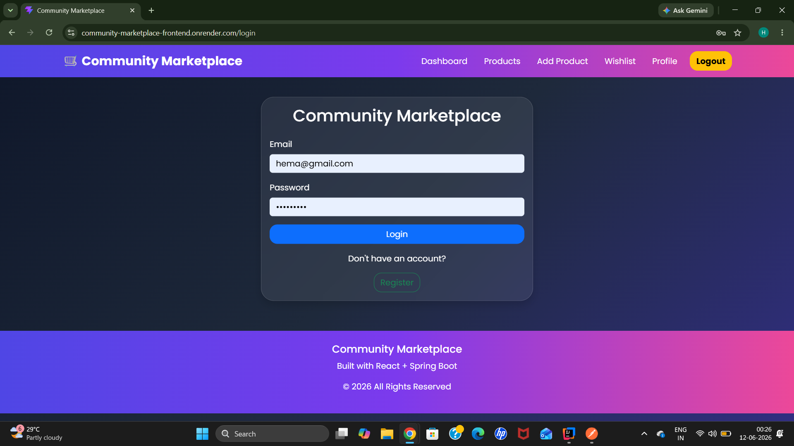
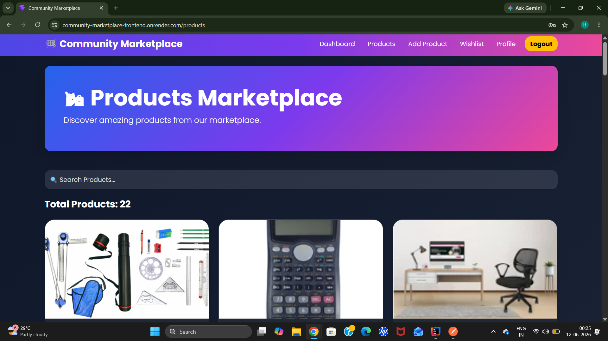
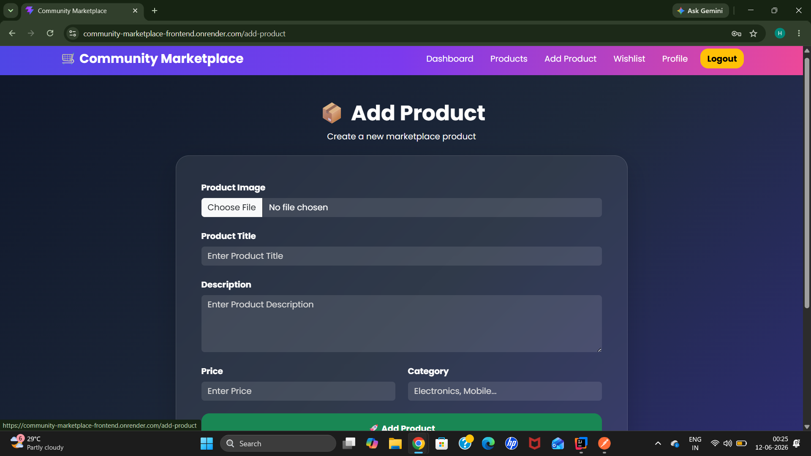
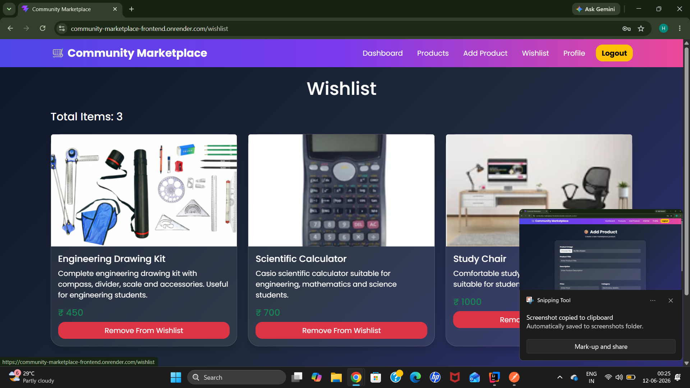
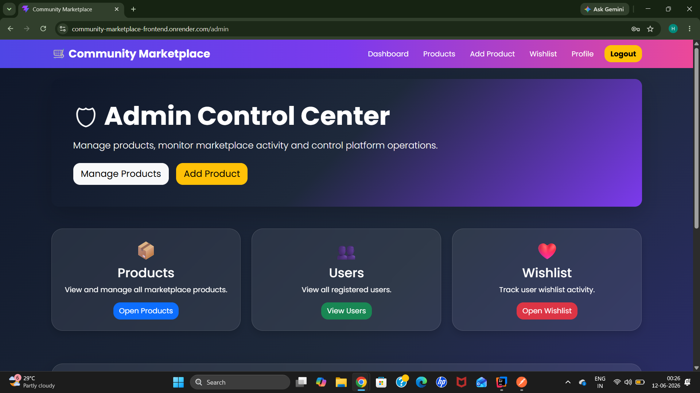

# Community Marketplace Platform

## Project Overview

Community Marketplace Platform is a full-stack web application that enables users to buy, sell, and manage products within a community. The platform provides secure authentication, product management, wishlist functionality, profile management, and an admin dashboard.

This project was developed to simulate a real-world marketplace application and gain hands-on experience in full-stack development, REST APIs, database management, authentication, cloud deployment, and responsive UI design.

---

## Problem Statement

Students and local community members often have unused items such as books, calculators, furniture, and study materials that could be useful to others. Existing marketplaces can be complex and not focused on local communities.

This platform provides a simple solution where users can:

- List products for sale
- Browse available products
- Save products to wishlist
- Manage their profile
- Connect with sellers

---

## Key Features

### User Features

- User Registration and Login
- Secure JWT Authentication
- Product Listing and Management
- Product Search Functionality
- Add Products to Wishlist
- View Seller Information
- User Profile Management
- Responsive Design for Desktop and Mobile

### Admin Features

- View All Users
- Manage Marketplace Data
- Monitor Platform Activity

### Product Features

- Add New Products
- Upload Product Images
- View Product Details
- Delete Products
- Search Products by Name
- Product Pagination Support

---

## Technologies Used

### Frontend

- React.js
- React Router
- Axios
- Bootstrap
- CSS

### Backend

- Java
- Spring Boot
- Spring Security
- JWT Authentication
- REST APIs

### Database

- MySQL

### Cloud Services

- Cloudinary (Image Storage)
- Render (Frontend Deployment)
- Railway (Database Hosting)

### Version Control

- Git
- GitHub

---

## Architecture

Frontend (React)
↓
REST API Communication
↓
Spring Boot Backend
↓
MySQL Database
↓
Cloudinary Image Storage

---

## Learning Outcomes

Through this project, I gained practical experience in:

- Full Stack Application Development
- REST API Design
- JWT Authentication and Authorization
- Database Design and Integration
- Cloud Deployment
- Git and GitHub Workflow
- Responsive UI Development
- Error Handling and Debugging

---

## Live Demo

Frontend:
https://community-marketplace-frontend.onrender.com

Backend API:
https://community-marketplace-backend-u5ms.onrender.com

Swagger Documentation:
https://community-marketplace-backend-u5ms.onrender.com/swagger-ui/index.html

---

## Future Enhancements

- Product Categories Filtering
- Product Editing Functionality
- Seller Dashboard
- Order Management System
- Payment Gateway Integration
- Chat Between Buyer and Seller
- Product Reviews and Ratings
- Email Notifications

---

## Project Screenshots

### Login Page

---

### User Dashboard

---

### Products Page

---

### Add Product Page

---

### Wishlist

---

### Admin Dashboard

## Author

Burusu Hemavathi

B.Tech - Computer Science and Data Science

Mohan Babu University

Aspiring Full Stack Java Developer
